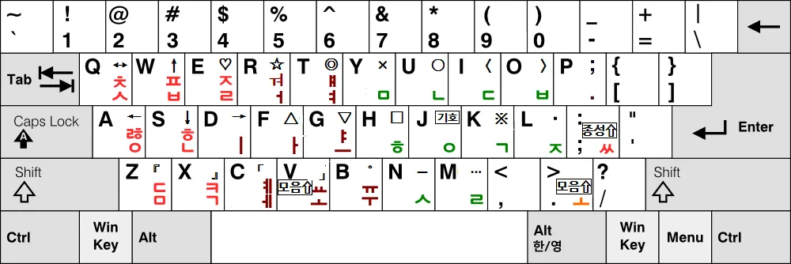
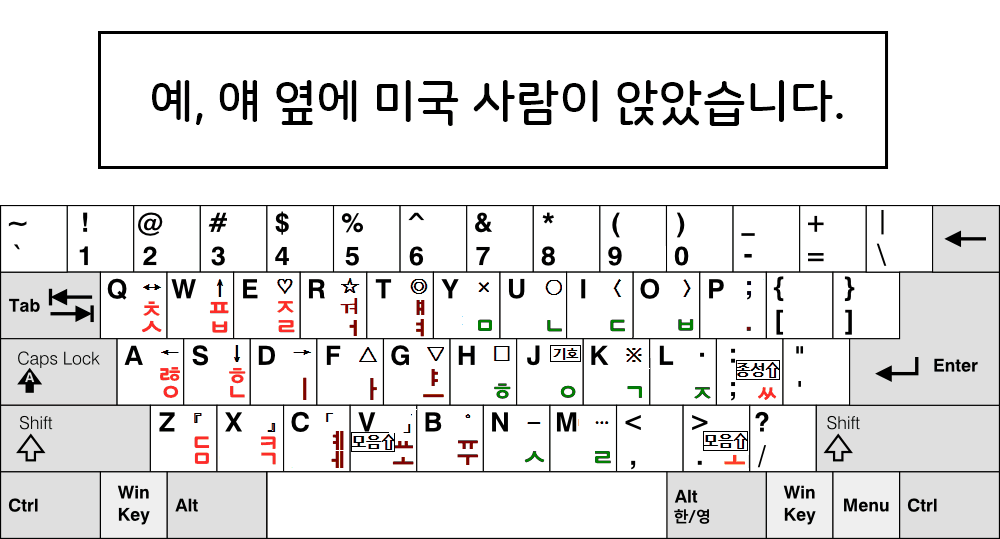

# 세모이 자판 개발 문서

## 일반 설명 링크

이 문서는 개발자를 위한 문서입니다.
일반 사용자를 위한 세모이 자판의 설명과 사용법은 다음 링크에서 보실 수 있습니다.

- 자판 설명: https://blog.naver.com/eekdland/220526834927
- 결합 규칙: https://blog.naver.com/eekdland/220239514856

---

## 프로젝트 개요

세모이 (세벌식 모아치기 e) 자판은 **속기형 한글 입력 방식을 일반 키보드에서 구현하기 위한 입력기**입니다.

2014년에 개인적인 녹취가 필요하여 시작된 프로젝트로

[공병우 세벌식](https://namu.wiki/w/세벌식/자판%20종류#공병우%20세벌식%20자판)을 응용하여 배열을 정하고, 속기형 입력 방식과 약어 구조를 설계했으며,

장기간의 실사용자 분들의 피드백을 통해 반복적인 수정이 이루어졌습니다.

개발은 Windows 날개셋 IME의 GUI로 이루어졌습니다.


목표:

- 일반 키보드에서 **모아치기 기반 한글 입력 구현**
- **한글 음절 단위 입력**
- **약어(dictionary) 기반 속기 및 이어치기 지원**

즉 세모이는 다음 구조를 목표로 합니다.

```
Chord / Sequence Input
→ Jamo Classification
→ Syllable Reconstruction
→ Abbreviation Expansion
```

---

## 배열도

<p style="text-align:center">
  
</p>

---

## 설계 목표

세모이 자판은 다음 네 가지 목표를 기반으로 설계되었습니다.

### 1. 속기 입력 모델 구현

속기 입력은 다음 특징을 가집니다.

- 여러 키를 **동시에 입력**
- 음절 단위 처리
- 약어 기반 입력

세모이는 이를 **일반 키보드에서 구현**하는 것을 목표로 합니다.

---

### 2. 순서 독립 입력

세모이는 입력 순서에 의존하지 않습니다.

예

```
ㄱ ㅏ ㄴ
ㅏ ㄱ ㄴ
ㄴ ㄱ ㅏ
```

모두

```
간
```

으로 처리됩니다.

이를 위해 **자모 재정렬 알고리즘**이 사용됩니다.

---

### 3. 음절 중심 입력

세모이는 모아치기 시 **음절 단위 입력 모델**을 사용합니다.

한글 음절 구조:

```
초성
중성
종성
```

입력기는 chord 내에서 이 세 요소를 분류합니다.

---

### 4. 약어 입력

입력 압축 체계에서는 **약어 시스템**이 중요한 역할을 합니다.

예:

```
특정 chord
→ 특정 단어
```

세모이는 **약어 사전 기반 입력 확장**을 지원합니다.


날개셋 입력기 IME에서의 약어 입력 구조는

chord 혹은 sequence
→ 옛한글 글자
→ 단어 치환

이라는 방식입니다.

---

## 세모이 자판과 Stenotype 구조

세모이 자판의 모아치기는 여러 키를 동시에 입력하여 음절이나 단어를 생성하는 **chord 기반 입력 시스템**입니다.

이 구조는 전통적인 영문 속기 장치인 **Stenotype**와 유사한 특징을 가집니다.

---

## Stenotype 입력 모델

Stenotype은 다음 방식으로 동작합니다.

```
여러 키를 동시에 누름
→ chord 생성
→ chord 해석
→ 단어 출력
```

즉 입력 단위가 **개별 문자(letter)** 가 아니라

```
stroke
```

입니다.

예:

```
STKPWHR
```

같은 chord가 하나의 입력 단위입니다.

---

## 세모이의 모아치기 입력 모델

세모이의 모아치기도 기본적으로 같은 구조를 사용합니다.

```
여러 키 동시 입력
→ chord 생성
→ 자모 분류
→ 음절 생성
→ 약어 확장
```

즉 입력 단위는

```
chord
```

입니다.

차이점은 다음입니다.

| 시스템 | 입력 결과 |
| --- | --- |
| Stenotype | 단어 |
| 세모이 | 음절 (약어 활용 시 단어) |

---

## 모아치기 입력 이벤트 처리

모아치기 시 세모이 입력기는 **키 누름(KeyDown)** 과 **키 뗌(KeyUp)** 이벤트를 모두 사용합니다.

입력 흐름:

```
KeyDown
→ chord buffer
→ KeyUp
→ 모든 키 해제
→ 음절 조합
```

즉 **모든 키가 떼어지는 순간 chord 처리가 완료됩니다.**

이 방식은 실제 속기 입력기와 유사합니다.

---

## 모아치기 강제 조합 종료 타이머

모아치기 시 세모이는 **강제 chord 종료 타이머**를 사용합니다.

기본값:

```
40 ms
```

이 타이머는 다음 상황을 처리하기 위해 존재합니다.

- 키가 동시에 눌리지 않는 경우
- 고속 타자 입력
- chord 경계 판단
- 한글 조합 중에 공백이 입력되는 경우 공백 삽입 타이밍 판단


동작:

```
timer expired
→ chord flush
→ syllable generation
```

각 사용자의 이상적인 타이머 값이 서로 충돌했기 때문에

이를 해결하기 위해 세모이 자판은 날개셋 입력기 IME에서의 경우

조합 종료 타이머의 수치를 각자 설정할 수 있도록 소개했습니다. 

---

## 입력 버퍼 구조

모아치기 시 입력기는 다음 정보를 유지합니다.

```
pressed keys
released keys
chord buffer
timer state
```

Chord 종료 조건:

1. 모든 키 해제
2. 타이머 종료

---

## 자모 분류

입력된 키는 다음 세 그룹으로 분류됩니다.

| 그룹 | 의미 |
| --- | --- |
| Onset | 초성 |
| Nucleus | 중성 |
| Coda | 종성 |

예:

```
{ㄱ, ㅏ, ㄴ}
→ C V T
→ 간
```

---

## 시프트 분리 시스템

세모이는 **자모 충돌 방지와 chord 안정성을 위해 시프트를 분리**합니다.

### 모음 시프트

모음 확장에 사용됩니다.

예

```
ㅛ
→ shift + ㅗ
```

---

### 종성 시프트

종성 입력 확장을 위해 사용됩니다.

종성 조합은 **초성 입력과 독립적으로 처리**됩니다.

---

### 분리된 시프트의 이유

시프트를 분리하면 다음 문제가 해결됩니다.

- chord 충돌
- 자모 역할 혼동
- 입력 안정성

즉

```
모음 확장
종성 확장
```

이 서로 간섭하지 않습니다.

---

## 된소리 입력

된소리는 **인덱스 키(index key)** 를 사용합니다.

예:

```
index + ㄱ
→ ㄲ
```

이 방식은 다음 장점이 있습니다.

- chord 안정성
- finger load 분산
- 속기 입력 호환성

---

## 약어 시스템

세모이는 **약어 사전(dictionary)** 을 지원합니다.

입력 흐름:

```
Chord / Sequence
→ syllable
→ dictionary lookup
→ expansion
```

예:

```
특정 chord / sequence
→ 단어
→ 문장
```

약어 시스템은 **속기 입력 속도를 크게 높이거나 입력을 압축하는 요소**입니다.

---

## 모아치기 입력기 구조

전체 구조:

```
KeyDown
↓
Chord Buffer
↓
KeyUp
↓
Chord Completion
↓
Jamo Classification
↓
Syllable Reconstruction
↓
Dictionary Expansion
↓
Output
```

---

## 모아치기 예시
<p style="text-align:center">
  
</p>

## 약어 입력 예시
<p style="text-align:center">
  
</p>

---

## 기존 세벌식과의 관계

세모이는 세벌식 계열 입력기이지만

기존 세벌식 자판과는 다음 차이가 있습니다.

| 항목 | 기존 세벌식 | 세모이 |
| --- | --- | --- |
| 입력 | 순차 | 순차 / 코드 |
| 자모 순서 | 연관 | 무관 |
| 입력 단위 | 자모 | 자모 / 음절 |

---

## 분석 결과

> 코퍼스 기반 순차 입력 분석 결과, 세모이 자판은 비교적 낮은 타이핑 피로를 보였으며,
>
> 약어를 통한 입력 압축을 사용할 경우 일반적인 이어치기 자판보다 자모당 타수를 낮출 수 있는 구조를 보였습니다.

세모이 자판은 모아치기를 이용할 수 있는 준속기 겸용 자판이지만,

이 분석에서는 다른 비교 자판들과 동일하게 **약어를 사용하지 않는 이어치기 순차입력을 기준**으로 분석하였습니다.

분석에서 세모이 자판은 비교적 낮은 총 피로 지표를 보였습니다.

기본 이어치기 입력에서는 일반적인 이어치기 자판보다 자모당 타수가 많지만,

약어를 이용한 입력 압축을 적용하면 자모당 타수를 크게 줄일 수 있습니다.


### 비교 결과 (이어치기 순차입력 기준)

| 자판<br>이름 | 자모당<br>타수 | 평균<br>피로<br>(손 이동) | 평균<br>피로<br>(글쇠) | 평균<br>피로<br>(손 꼬임) | 평균<br>피로<br>(가위질<br>패턴) | 손가락<br>분산<br>패널티 | 총 피로<br>(자모에 대한<br>평균) |
| ---------- | ------------------------------- | ----------- | --------- | ----------- | ------------- | --------- | --------------- |
| 두벌식 표준 | 1.0501 | 0.3820 | 0.8661 | 1.0909 | 0.2152 | 0.0046 | 2.6867 |
| 세벌식 A | 1.0339 | 0.4526 | 0.9089 | 0.9899 | 0.1761 | 0.0150 | 2.6281 |
| 세벌식 B | 1.0298 | 0.4147 | 0.8756 | 0.9412 | 0.1879 | 0.0148 | 2.5062 |
| 신세벌식 A | 1.0385 | 0.3830 | 0.8280 | 0.9852 | 0.1929 | 0.0060 | 2.4871 |
| 신세벌식 B | 1.0297 | 0.3700 | 0.8302 | 1.0092 | 0.1600 | 0.0323 | 2.4722 |
| **세모이 자판** | **1.0925**<br>**(약어 사용 시<br>0.9360)** | **0.3726** | **0.7919** | **0.8484** | **0.1414** | **0.0517** | **2.4051** |


### 해석

* 세모이 자판은 글쇠 피로, 손 꼬임 피로, 가위질 패턴 피로가 낮게 나타났으며, 이를 종합한 총 피로도 역시 낮은 수준을 보였습니다.

* 손가락 분산 패널티는 상대적으로 높게 나타났으며, 여러 손가락을 함께 사용하는 모아치기 특성이 영향을 준 것으로 볼 수 있습니다.

* 손 이동 피로는 신세벌식 B보다 높지만, 두벌식 표준과 신세벌식 A보다 낮은 수준으로 나타났습니다.

* 손가락 분산 패널티는 비교 대상 가운데 가장 높습니다.

  이는 모아치기 특성상 힘이 강한 검지 위주로 다른 자판들보다 타자가 더욱 이루어지도록 설계되었기 때문입니다.

* 세모이 자판의 기본 자모 당 타수는 **1.0925타**로, 비교 대상 이어치기 자판의 약 1.03 ~ 1.05타보다 높습니다.

  따라서 약어를 사용하지 않는 기본 입력만 비교하면 입력 타수 면에서는 불리합니다.

* 그러나 세모이 자판의 약어를 코퍼스에 적용한 결과 자모 당 타수는 **0.9360타**까지 감소하였습니다.

  이는 약어를 사용하지 않는 비교 대상 자판보다 낮은 수치입니다.

* 따라서 세모이 자판은 기본 배열 자체의 타수 최소화보다는 **각 자판의 장점을 반영하여 개선한 피로 감소와 약어를 통한 입력 압축을 함께 활용하는 준속기 겸용 자판**으로 볼 수 있습니다.


### 입력 압축

세모이 자판은 자주 사용하는 낱말과 표현을 약어로 입력할 수 있습니다.

약어에 공백 출력이 포함된 경우에는 뒤따르는 스페이스 입력도 함께 줄어듭니다.


천만 자모 코퍼스에서 측정한 결과는 다음과 같습니다.

| 입력 방식        |     자모 당 타수 |
| ------------ | ----------: |
| 일반 이어치기 자판   | 약 **1.034** |
| 세모이 자판 기본 입력 |  **1.0925** |
| 세모이 자판 약어 사용 |  **0.9360** |

약어를 모두 사용할 수 있다고 가정한 이론적 분석에서는 세모이 자판의 입력 타수가 **1.0925 → 0.9360타/자모**로 약 **14.3% 감소**하였습니다.

일반 이어치기 자판의 1.034타/자모와 비교하면 약어 사용 시 필요한 입력 타수는 약 **9.5% 적게 나타났습니다.**

따라서 세모이 자판은 기본 입력에서는 일반 이어치기 자판보다 타수가 많지만,

약어를 적극적으로 사용하는 경우에는 이러한 차이를 상쇄하고 추가적인 입력 압축이 가능한 것으로 분석되었습니다.

> **주의:** 약어 사용 시의 0.9360타/자모는 등록된 약어를 해당 코퍼스에서 사용할 수 있는 경우 모두 사용한다고 가정한 이론적 분석값입니다.
>
> 실제 입력 압축률은 사용자가 익힌 약어의 수와 실제 사용 빈도에 따라 달라질 수 있습니다.

---

## 제한 사항

- 일반 키보드 기반 chord 입력
- 약어 사전의 구현
- 날개셋 입력기 등의 구현 IME 의존

---

## 프로젝트 의의

세모이 자판은 다음 질문에서 출발했습니다.

> 속기형 한글 입력 압축을 일반 키보드에서 구현할 수 있을까?
> 

이 프로젝트는 그 질문에 대한 **실험적 구현**입니다.

세모이 자판의 설계 철학은 다음과 같이 요약할 수 있습니다.

> 일반 키보드에서 속기형 한글 입력 압축 시스템을 구현한다.
> 

즉 세모이는

```
Stenotype-like Korean input
```

을 목표로 한 시스템입니다.

---

## 세모이 자판과 두벌식 자판 모아치기의 차이

세모이 자판과 [두벌식 자판 모아치기](https://github.com/Sinseiki/Dubeolsik_Moachigi)의 차이를 개발자 관점에서 보면 다음입니다.

| 입력기 | chord 범위 |
| --- | --- |
| 세모이 (세벌식 모아치기 e) | 초성 + 중성 + 종성 |
| 두벌식 모아치기 | 초성 + 중성 |

즉 두벌식 모아치기는

```
세모이 입력 모델의 부분 구현
```

으로 볼 수 있습니다.

---

## 정리

세모이 자판은

> **속기형 입력 압축 시스템을 일반 키보드에서 구현하려는 chord / sequence 겸용 한글 입력기**
> 

입니다.

| 요소 | 설명 |
| --- | --- |
| 약어 사전 | 약 1300 entries |
| 입력 구조 | chord / sequence-based |
| 조합 규칙 | 옛한글 확장 (약어 조합에 활용) |
| 최대 chord | 7 keys |

즉

```
rule-based input system + dictionary
```

구조입니다.

---

## 기타

구현을 위한 자판의 규격은 다음 링크에서 보실 수 있습니다.

https://raw.githubusercontent.com/Sinseiki/Semo-e_keyboard/refs/heads/main/세벌식%20모아치기%20e%20개발%20규격.pdf

---

## 참고 사항

이 자판과 저장소는 공공성을 위하고 독점화를 막기 위해 [CC BY-SA 4.0](https://creativecommons.org/licenses/by-sa/4.0/legalcode.ko) 라이선스로 공개되어 있습니다.

또한 원칙은 아니지만, 다른 곳에 소개하실 때 ssgi.kr 를 함께 표시해주시면 감사드리겠습니다.


본 자판 XML 파일은 날개셋 입력기의 설정 형식을 사용합니다.

날개셋 입력기 자체의 저작권은 제작자 [김용묵](http://moogi.new21.org) 님께 있습니다.

---

## 연관 자판 프로젝트

이 저장소들은 한국어 및 영어 키보드 배열 및 타자 인체공학에 관하여 진행 중인 연구 프로젝트의 일부입니다.

| 이름 | 설명 |
| --- | --- |
| [**세벌식 모아치기 e (세모이)**](https://github.com/Sinseiki/Semo-e_keyboard) | **입력을 압축하는 준속기 겸용 자판** |
| [두벌식 줄맞춤 e (두줄이)](https://github.com/Sinseiki/Dujul-e_keyboard) | 표준 두벌식 응용 효율 개선 자판 |
| [두벌식 겹받침 e (두겹이)](https://github.com/Sinseiki/Dugyeob-e_keyboard) | 표준 두벌식 배열 기반 개선 자판 |
| [두벌식 자판 모아치기](https://github.com/Sinseiki/Dubeolsik_Moachigi) | 두벌식 자판의 모아치기 연구 |
| [세벌식 ROS-e (ROSE)](https://github.com/Sinseiki/ros-e_keyboard) | 영어 모아치기 및 순서 교정 자판 |
| [타자 피로도 분석기](https://github.com/Sinseiki/typing-fatigue-analyzer) | 자판 연구를 위한 타자 피로도 분석 도구 |

※ 타자 피로도 분석기는 [Hyunjun Ji](https://github.com/isty2e) 님의 분석기를 기반으로 연구 및 수정되었습니다.
