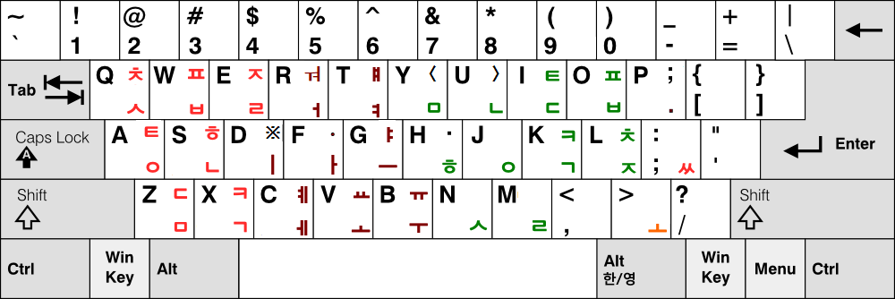
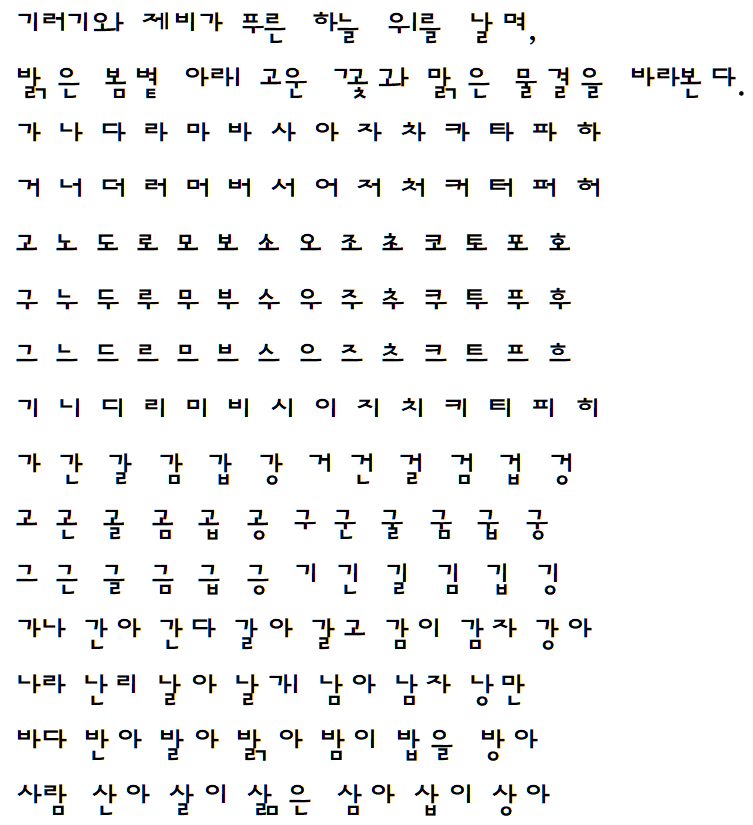

# 세모이 직결식 자판

<p style="text-align:center">
  
</p>

세모이 직결식 자판은 세모이 자판의 자모 배치를 바탕으로, **초성·중성·종성 활자를 직접 이어쳐 한글을 모아쓰는 3벌 기계식 타자기 설계안**입니다.
모바일에서도 응용하여 구현할 수 있으며 xml 파일에는 PC용 부가기능들이 함께 들어 있습니다.

직결식 구현 자체는 ttf 폰트 파일로 확인하실 수 있습니다.
(ttf 폰트 파일은 [2바이트 글자 표현이 불가한 게임 등에서 한글 번역](https://blog.naver.com/eekdland/221037040094)을 위해 사용할 수도 있습니다. ([CC-BY-SA 4.0](https://creativecommons.org/licenses/by-sa/4.0/deed.ko)))

직결식 자판은 일반적인 세모이의 모아치기 입력이나 소프트웨어 조합 규칙을 기계식 타자기로 그대로 옮기는 것을 목표로 하지 않습니다.
이 설계에서는 기계적으로 직접 구현할 수 있는 기본 자모 입력만을 대상으로 하며, 소프트웨어에서만 가능한 조합 규칙과 기호 확장은 제외합니다.

> 현재 상태는 실제 타자기가 제작된 것이 아닌 **기계식 설계안(proof of concept)** 입니다.


## 1. 설계 이유
기계식 구현 가능성을 검토하는 이유는 단순히 옛 타자기의 구조를 재현하기 위해서만은 아닙니다.
한국의 한글 기계화 역사에서는 전자식 한글 입력기가 없어도 한글 문서를 직접 작성할 수 있는 독립적인 인자 수단이 실제로 사용되어 왔습니다.
대표적인 역사적 사례로 공병우 세벌식 타자기는 한국전쟁 정전협정 한글본 작성에 사용된 것으로 알려져 있습니다.

이렇듯 순수 기계식 입력 체계에는 다음과 같은 기술적 의미가 있습니다.
- 전원 공급이 필요하지 않습니다.
- 운영체제나 한글 IME가 필요하지 않습니다.
- 전자적인 음절 조합기가 필요하지 않습니다.
- 저장장치나 문자 인코딩 체계에 의존하지 않고 종이에 직접 기록합니다.

전자장비를 사용할 수 없는 극단적인 비상상황에서도 원리상 독립적으로 사용할 수 있습니다.
다만 여기서 중요한 것은 특정 재난 시나리오가 아니라 한글 입력 원리가 전자식 IME에 논리적으로 종속되지 않고 순수한 기계장치만으로도 완결될 수 있는가입니다.

세모이 직결식은 이 관점에서 다음과 같은 경로만으로 한글을 기록할 수 있는 설계를 목표로 합니다.

```
사람의 타건
   ↓
글쇠와 기계 링크
   ↓
고정된 자모 활자 타격
   ↓
고정된 기계식 escapement
   ↓
리본과 종이에 직접 인자
```

## 2. 기본 원리

세모이 직결식은 다음 원칙을 사용합니다.

-   초성·중성·종성을 각각 별도의 활자로 가지는 **세벌식**입니다.
-   자모는 **모아치기가 아니라 이어치기**로 입력합니다.
-   각 글쇠는 하나의 고정된 활자를 직접 타격합니다.
-   각 활자는 고정된 인자 위치(offset)를 가집니다.
-   글쇠를 친 뒤의 전진량(escapement)도 해당 글쇠에 고정되어 있습니다.
-   다음에 어떤 자모가 입력될지를 기계가 판단할 필요가 없습니다.
-   전자적인 음절 조합이나 문맥 판단을 사용하지 않습니다.

이를 추상화하면 다음과 같습니다.

``` text
글쇠 입력
   │
   ├─> 해당 자모 활자 타격
   │       └─> 활자에 정해진 고정 위치에 인자
   │
   └─> 해당 글쇠에 정해진 전진량 선택
           └─> escapement 작동
                   └─> carriage 전진
```

즉 각 글쇠 `K`는 개념적으로 다음 두 값을 가집니다.

``` text
K = (고정 인자 위치, 고정 전진량)
```

같은 글쇠는 입력 문맥에 관계없이 항상 같은 방식으로 동작합니다.

## 3. 공병우식 기계 타자기와의 관계

세모이 직결식은 한글을 초성·중성·종성 활자로 직접 모아 찍는다는 점에서 기존 3벌 기계식 한글 타자기와 같은 계열에서 생각할 수 있습니다.

그러나 기존 공병우식 타자기의 기계 구조를 그대로 사용하는 것은 아닙니다.

공병우 타자기 계열에서는 한글 모아쓰기를 기계적으로 처리하기 위하여 움직글쇠·안움직글쇠의 구별과 조합 위치에 맞춘 별도의 모음 활자 등이 사용될 수 있습니다.
세모이 직결식에는 이중모음 조합을 위한 별도의 `ㅏ`, `ㅜ` 활자가 없으므로 그러한 방식을 그대로 적용하기 어렵습니다.

따라서 세모이 직결식에서는 **안움직글쇠에 의존하지 않고, 모든 기본 자모에 양의 전진량을 부여하는 가변 전진 방식**을 실험하고 있습니다.

## 4. 가변 전진(Variable Escapement)

현재 실험에서는 자모마다 완전히 다른 전진량을 사용하는 대신, 실제 기계 구조로 이산화하기 쉽도록 전진량을 몇 단계의 정수비로 제한합니다.

현재 기준은 다음 네 단계를 사용합니다.

``` text
10 : 13 : 23 : 25
```

이를 최소 기계 단위 `u`로 표현하면 각 글쇠의 전진량은 다음 중 하나가 됩니다.

``` text
10u
13u
23u
25u
```

이 값들은 글자 종류 자체를 뜻하지 않습니다.
즉 `초성=25`, `중성=13`, `종성=10`처럼 벌마다 하나의 값을 사용하는 방식이 아닙니다.
각 활자에 적합한 전진 단계가 개별적으로 배정되며 해당 내용은 ttf 폰트 파일에 들어 있습니다.

중요한 점은 네 값이 모두 **양수**라는 것입니다.
현재 설계에서는 0 전진(dead key)을 사용하지 않습니다.

### 왜 정수비인가?

실제 기계식 타자기를 가정하면 전진량은 추상적인 폰트 단위보다 rack, escapement 등의 기계적 최소 이동 단위를 기준으로 표현하는 편이 적절해 보입니다.

따라서 현재 실험은 글꼴에서 얻은 연속적인 advance 값을 그대로 사용하는 대신 유한한 정수 단계로 근사하여 다음 조건을 확인하는 데 목적이 있습니다.

> 제한된 수의 기계적 전진 단계만으로 세모이 직결식의 한글 모아쓰기를 판독 가능한 수준으로 구현할 수 있는가?

`10:13:23:25`는 현재의 실험값이며 최종 기계 규격으로 확정된 값은 아닙니다. 이는 활자의 모양에 영향을 받는 값이기 때문입니다.
현재 해당 비율로 나눔바른고딕옛한글 폰트에 기반한 직결고딕세모이 ttf 폰트를 통해 각 글자의 가독성을 확인하였습니다.

<p style="text-align:center">
  
</p>

만일 직접 확인을 원하신다면, DirectGothic-Semoe.ttf 파일을 설치하시고 워드나 아래아 한글 등의 위지윅 편집기에서 영타로 입력해 보실 수 있습니다. (폰트명은 영어가 한글로 강제로 변환되어 깨져서 표시되니 참고해주시기 바랍니다.)

## 5. 활자면의 상대 인자 위치 고정 및 전진량 가변화

이 설계에서 특히 중요한 점은 **활자면의 상대 인자 위치와 carriage의 전진량을 분리해서 생각하는 것**입니다.

``` text
인자 위치(offset) ≠ 전진량(advance)
```

예를 들어 가로모음 활자는 현재 인자점을 기준으로 왼쪽이나 아래쪽에 치우친 위치에 새겨질 수 있습니다.
활자를 찍은 뒤 carriage가 얼마만큼 이동하는지는 이 활자면의 위치와 별개의 기계적 변수입니다.

초기 실험에서는 advance 변화에 맞추어 글리프 자체의 위치까지 이동시켰으나, 이 경우 `고`가 `그`처럼 보이거나 `바다`와 `비다`의 구별이 약해지는 문제가 발생했습니다.

따라서 ㅗ나 ㅜ, ㅡ는 활자면의 왼편에 새겨서 고정시키고, 전진량은 활자면의 위치와 무관하게 가변하도록 설계하였습니다.

## 6. 현재 실험 결과

4단계적 전진량을 사용한 여러 실험을 거쳐 현재는 다음 정수비를 사용하고 있습니다.

``` text
10 : 13 : 23 : 25
```

현재 결과는 이상적인 활자 디자인이라고 보기는 어렵지만, 이 설계의 목적은 디지털 글꼴의 미려함을 확보하는 것이 아니라 다음 명제를 검토하는 것입니다.

> 각 자모에 고정된 활자 위치와 고정된 양의 전진량 하나만을 부여하고도,
> 전자적 문맥 판단 없이 기계적으로 한글을 모아쓸 수 있는가?
> 그리하여 세모이 자판을 기계식 타자기에 이식할 수 있는가?

현재 결과는 이 방식의 **기계식 구현 가능성을 검토할 수 있는 proof of concept**를 제공합니다.

## 7. 기계식 구현에 대한 현재 판단

가변 전진 자체는 순수 기계식 타자기에서 알려진 proportional/differentialescapement 계열의 원리로 구현할 수 있을 것으로 보입니다.
따라서 글쇠에 따라 몇 종류의 고정된 전진량 가운데 하나를 선택하는 기능 자체는 기계식 타자기의 원리와 모순되지 않을 것으로 보입니다.

세모이 직결식에 필요한 동작은 개념적으로 다음과 같습니다.

``` text
활자 A → 타격 + 10u 전진
활자 B → 타격 + 13u 전진
활자 C → 타격 + 23u 전진
활자 D → 타격 + 25u 전진
...
```

각 글쇠의 전진량은 미리 결정되어 있으므로 다음 입력을 알아야 하는 상태기계나 전자적 조합기는 필요하지 않습니다.

1.  초성·중성·종성 활자가 각각 분리되어 있습니다.
2.  자모를 이어쳐 직접 인자합니다.
3.  음절을 소프트웨어적으로 조합하지 않습니다.
4.  필요한 가변 전진은 순수 기계식 escapement로 구현 가능한 종류의 동작으로 보입니다.


다만 실제 기계를 제작하지 않았으므로 다음 사항은 아직 검증 대상입니다.

-   실제 typebar와 type slug의 크기
-   활자끼리의 물리적 간섭 여부
-   인자점 및 type guide 구조
-   ribbon과 인자 영역의 허용 범위
-   escapement의 실제 tooth pitch와 제작 공차
-   반복 타건 시 정렬 오차의 누적
-   전체 한글 조합에 대한 인자 위치 검증
-   `10:13:23:25`보다 적합한 전진비의 존재 여부

따라서 현재 단계에서 이 설계를 실물 타자기가 만들어지기 전의 **설계안**으로 보고 있습니다.

## 8. 자판 피로도 분석 결과
> 각 자판은 동일한 물리적 타건 조건을 가진 가상의 기계식 타자기에서 이어치기로 입력한다는 전제하에 분석하였습니다.
> 표준 두벌식 자판은 실제 기계식 두벌식 타자기의 조합 기구를 모사한 것이 아니라, 입력된 자음의 초성·종성 여부가 자동으로 구별된다는 가정하에 비교 대상으로 분석하였습니다.

### 신세벌식 A 직결식

신세벌식 A 직결식은 현존하는 신세벌식 계열 자판 하나를 기계식 직결 입력이 가능하도록 변형한 비교용 자판입니다.

- 자주 사용하는 중성이 배치된 글쇠(ㅕ,ㅔ,ㅓ,ㅣ,ㅏ,ㅡ,ㅔ,ㅗ,ㅜ)에서는 중성을 아랫글쇠로 놓고 종성을 윗글쇠에 놓았습니다.
- 자주 사용하는 종성이 배치된 글쇠(ㅅ,ㄹ,ㅇ,ㄴ,ㅁ,ㄱ)에서는 종성을 아랫글쇠에 놓고 중성을 윗글쇠에 놓았습니다.
- 이는 소프트웨어 조합을 전제로 만들어진 신세벌식 계열 자판을 기계식 초·중·종성 직결 방식으로 변형할 경우의 특성을 비교하기 위한 것입니다.

### 결과 표

| 자판<br>이름 | 자모당<br>타수 | 평균<br>피로<br>(손 이동) | 평균<br>피로<br>(글쇠) | 평균<br>피로<br>(손 꼬임) | 평균<br>피로<br>(가위질<br>패턴) | 손가락<br>분산<br>패널티 | 총 피로<br>(자모에 대한<br>평균) |
| ---------- | ------------------------------- | ----------- | --------- | ----------- | ------------- | --------- | --------------- |
| 공병우 최종 자판 | 1.0339 | 0.4526 | 0.9089 | 0.9899 | 0.1761 | 0.0150 | 2.6281 |
| **세모이 직결식 자판** | **1.0941** | **0.4667** | **0.8900** | **0.9061** | **0.1523** | **0.0406** | **2.6830** |
| 두벌식 표준 자판 | 1.0501 | 0.3820 | 0.8661 | 1.0909 | 0.2152 | 0.0046 | 2.6867 |
| 신세벌식 A 직결식 자판 | 1.0896 | 0.5804 | 1.0093 | 1.0039 | 0.1524 | 0.0406 | 3.0719 |


### 결과 해석

- **공병우 최종 자판**은 기계식 타자기 사용까지 고려하여 설계된 자판으로, 이 분석에서도 가장 낮은 자모당 타수와 가장 낮은 총 피로도를 나타냈습니다.

- **신세벌식 A 자판**은 소프트웨어 구현을 전제로 한 자판으로, 기계식 직결 입력이 가능하도록 변형하면 윗글쇠 사용이 증가합니다. 비교용 직결식에서는 자모에 대한 평균 총 피로도가 높게 나타났습니다.

- **세모이 직결식 자판**은 공병우 최종 자판보다 자모당 타수가 많습니다. 반면 익혀야 할 글쇠 수가 공병우 최종 자판보다 적으며, 자모에 대한 평균 총 피로도는 공병우 최종 자판보다 높고 두벌식 표준 자판보다 근소하게 낮게 나타났습니다.

 - **세모이 직결식 자판**의 총 피로도는 **2.6830**으로, 초·종성 판별을 소프트웨어가 수행한다고 가정한   두벌식 표준 자판의 **2.6867**과 비슷한 수준으로 나타났습니다.

- 따라서 이 결과는 세모이 직결식이 기계식 두벌식보다 우수하다는 의미가 아닙니다. 오히려 세모이 직결식은 초·중·종성을 글쇠 단계에서 직접 구별하여 별도의 한글 조합 소프트웨어에 의존하지 않으면서도, 소프트웨어의 초·종성 판별을 허용한 두벌식 표준과 비슷한 수준의 타건 피로도를 보였다는 데 의미가 있습니다.

- 특히 같은 기계식 직결 입력을 가정한 신세벌식 A 직결식의 총 피로도  **3.0719**보다 세모이 직결식의 **2.6830**이 낮게 나타났습니다. 이는 세모이 자판을 직결 입력에 맞게 별도로 구성한 경우와, 소프트웨어용 신세벌식 자판을 직결식으로 변형한 경우 사이에 차이가 있음을 보여줍니다.

따라서 이 분석에서 세모이 직결식은 기계식 타자기를 직접 고려하여 발전한 공병우 최종 자판의 입력 효율에는 미치지 못하지만, 비교적 적은 학습 글쇠 수를 유지하면서 두벌식 표준 자판과 비슷한 수준의 총 피로도로 **초·중·종성의 기계식 직결 입력을 구현하는 절충안**으로 볼 수 있습니다.


## 9. 범위

이 저장소에서 기계식 구현 가능성을 논할 때에는 다음 범위만을 대상으로 합니다.

### 포함

-   기본 초성
-   기본 중성
-   기본 종성
-   자모의 직접 입력
-   이어치기
-   고정 활자 위치
-   기계식 가변 전진

### 제외

-   소프트웨어 조합 규칙
-   기계적으로 직접 구현할 수 없는 확장 조합
-   기호 확장
-   예측 입력
-   문맥에 따른 동적 활자 선택
-   일반 세모이의 모아치기 및 약어 처리

따라서 세모이 직결식은 일반 세모이 입력 방식 전체를 기계화한 것이 아니라, **세모이 자판을 바탕으로 기계식 직접 인자가 가능하도록 구성한 파생 설계**입니다.

## 10. 현재 상태

**Status: Experimental mechanical design / Proof of concept**

현재까지 확인된 것은 다음과 같습니다.

-   3벌 직접 인자 구조: 가능
-   이어치기: 가능
-   자모별 고정 offset: 적용
-   자모별 고정 escapement: 적용
-   0 전진 없이 구성: 가능
-   4단계 양의 정수 전진비: 시험 성공
-   현재 시험비: `10:13:23:25`
-   시험 문자열: 판독 가능
-   실제 기계 제작: 미실시
-   전체 조합 및 기계공학적 공차 검증: 필요

따라서 이 프로젝트의 현재 목표는 **실제 제작 가능한 기계식 3벌 타자기 설계로 성립하는지를 단계적으로 검증하는 것**입니다.
